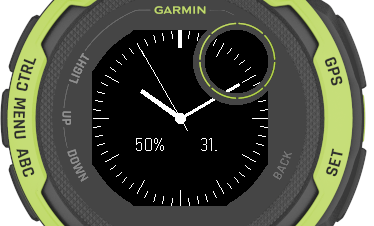
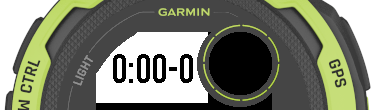
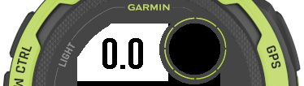

# Garmin Connect IQ SDK applications

A minimalistic watch face and pace / distance data fields for my Garmin Instinct 2 Solar using the [Garmin Connect IQ SDK](https://developer.garmin.com/connect-iq/overview/).

## GuruFace ##

A simple analog watch face with optional battery level, day-of-month, second hand and inverted display:

## GuruPace ##

A pace field without label and a 'gamification' effect: Seconds are rounded and shown without decimal places. The value after the dash shows the number of tenths-of-a-second left for the rounded seconds to decrease by one. The field uses the largest possible font which causes no clipping.

## GuruDist ##
A distance field without label and only one decimal place. The field uses the largest possible font which causes no clipping. 

